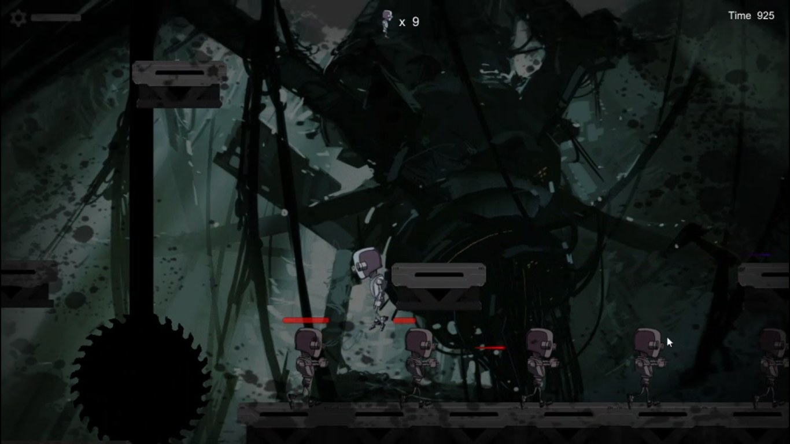
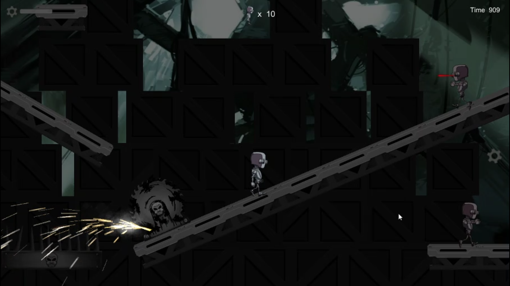
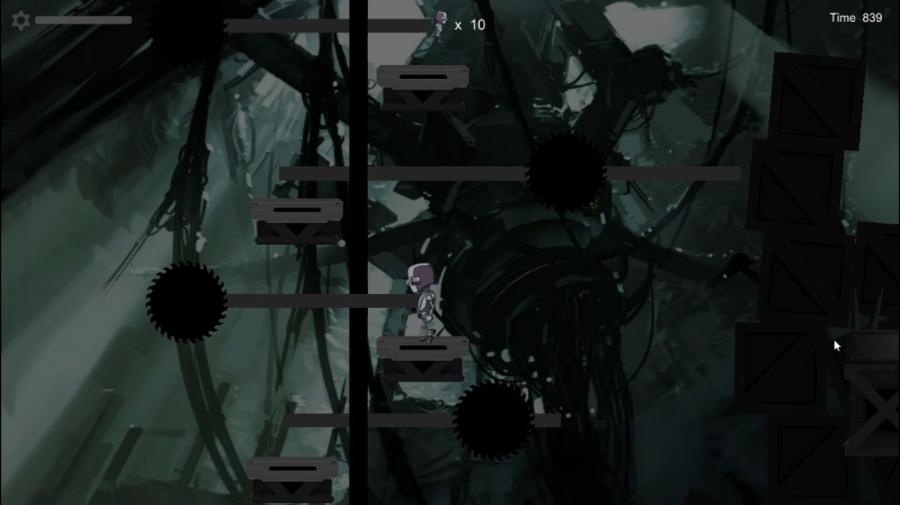
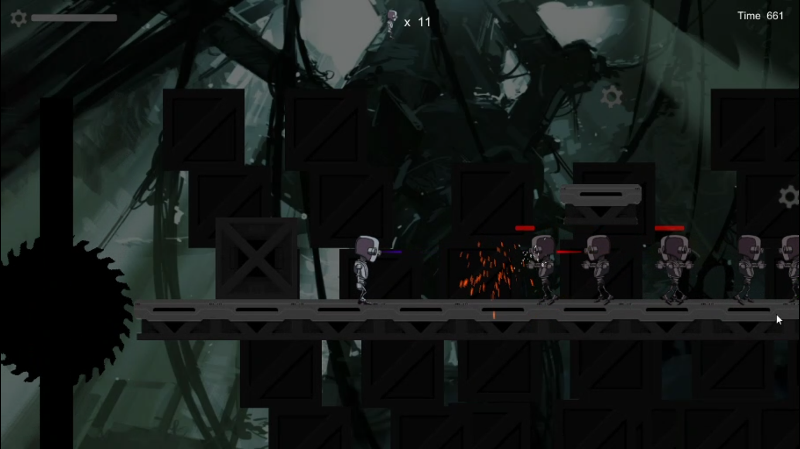
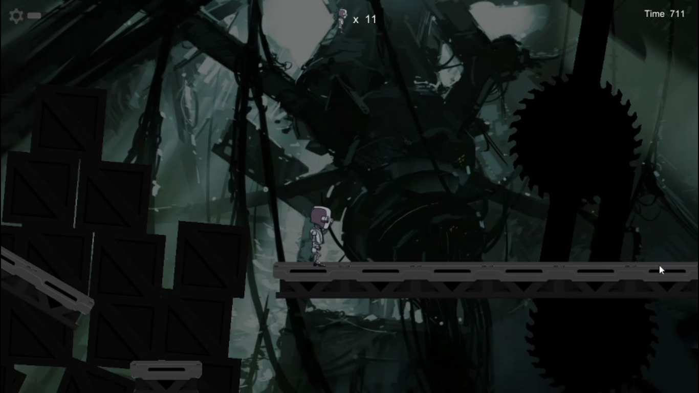
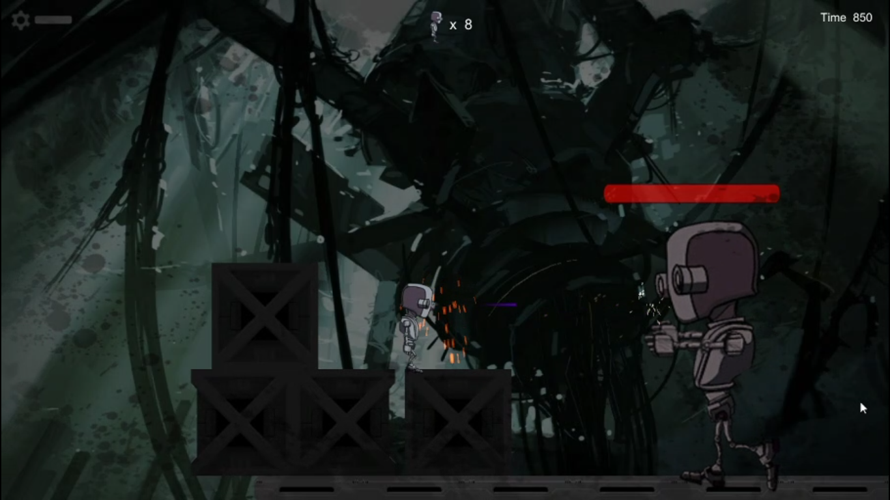
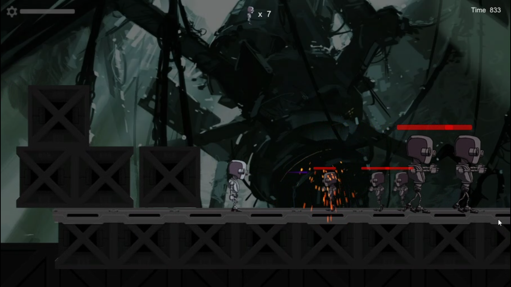

# Robot Zombies

## Gameplay - https://www.youtube.com/watch?v=gzWd3tGUY6M
## Itch.io - https://crew7studiogames.itch.io/robot-zombies

2D side scrolling platformer shooting game, made with Unity game engine. 
This is the first game I've made on my own. 

### STORYLINE : 
Your are the only robot  left. A virus out break turned all robots into zombies. Fight through them to reach the end. At the end you must fight the Boss zombie robot to survive. 

### CONTROLS : 
* Use AD or Left/Right Arrows to Move
* Use Space button to Jump
* Use Left Ctrl or Left Mouse button to Fire 

### TOOLS USED : 
* Unity game engine
* Adobe photoshop

## SCREENSHOTS : 

Goto Builds and click on the .exe file to play the game. 

### Unfortunately you cannot load the game  on unity since it shows missing prefab (As a consequence of loading old unity projects in new unity engine )

Thank to Gamesplusjames Tutorial - https://www.youtube.com/playlist?list=PLiyfvmtjWC_Up8XNvM3OSqgbJoMQgHkVz
 

